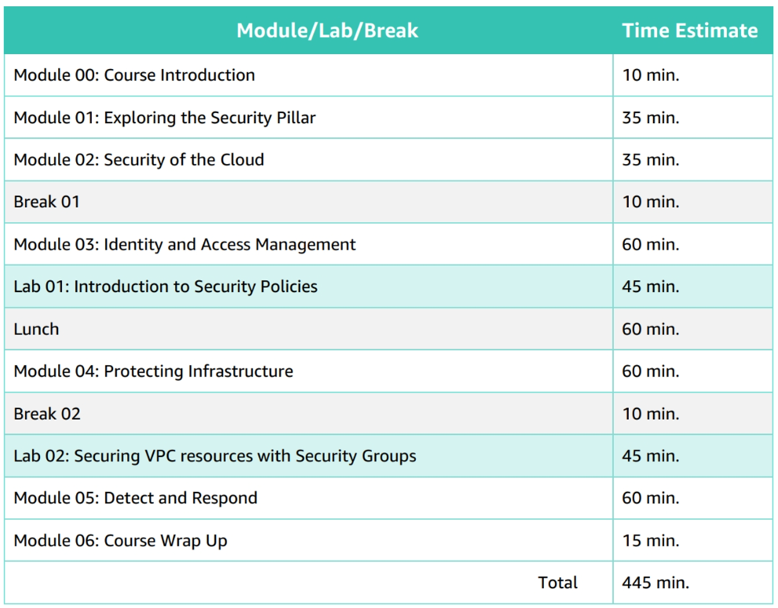

# AWS Security Essentials

## Course Links

* [Courseware at eVantage by Gilmore Global](https://evantage.gilmoreglobal.com/#/user/signin)
* [AWS Certification](https://aws.amazon.com/certification/)
* [AWS Certified Security - Specialty](https://aws.amazon.com/certification/certified-security-specialty/)

## Resources

* [AWS Cloud Security](https://aws.amazon.com/security/)
* [AWS Compliance Programs](https://aws.amazon.com/compliance/programs/)
* [AWS Compliance Centre](https://www.atlas.aws/)
* [AWS Cloud Products](https://aws.amazon.com/products/)
* [AWS Pricing Calculator](https://calculator.aws/#/)
* [AWS Well-Architected](https://aws.amazon.com/architecture/well-architected/)
* [AWS Architecture Center](https://aws.amazon.com/architecture/)
* [Security and Compliance - Whitepapers](https://docs.aws.amazon.com/whitepapers/latest/aws-overview/security-and-compliance.html)

## Modules / Labs / Break

