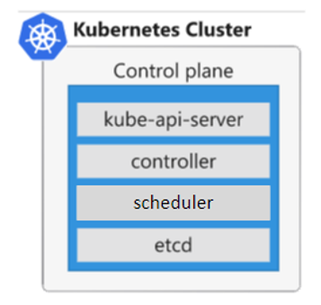
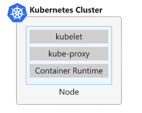
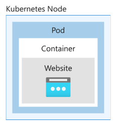
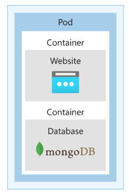

# Introduction into Kubernetes

**Kubernetes** is a portable, extensible open-source platform for managing and orchestrating containerized workloads, it abstracts away complex container management tasks.  
It provides declarative configuration to orchestrate containers in different computing environments.  This orchestration platform gives you the same ease of use and flexibility you may already know from PaaS or IaaS offerings.

# Benifits of Kubernetes

- Self-healing of containers - An example would be restarting containers that fail or replacing containers.
- Scaling deployed containers up or down dynamically, based on demand.
- Automating rolling updates and rollbacks of containers.
- Managing storage.
- Managing network traffic.
- Storing and managing sensitive information, such as usernames and passwords.

# Kubernetes considerations
- With Kubernetes, you can view your datacenter as one large compute resource. You don't worry about how and where you deploy your containers, only about deploying and scaling your apps, as needed

It's important to understand that Kubernetes isn't a single installed app that comes with all possible components needed to manage and orchestrate a containerized solution:

- Aspects such as deployment, scaling, load balancing, logging and monitoring are all optional. You're responsible for finding the best solution that fits your needs.

- Kubernetes doesn't limit the types of apps that can run on the platform. If your app can run in a container, it can run on Kubernetes. To make optimal use of containerized solutions, your developers need to understand concepts, such as microservices.

- Kubernetes doesn't provide middleware, data-processing frameworks, databases, caches, or cluster storage systems. All these items are run as containers, or as part of another service offering.

- For Kubernetes to run containers, it needs a container runtime, like Docker. The container runtime is the object that's responsible for managing containers. For example, the container runtime starts, stops, and reports on the container's status.

- You're responsible for maintaining your Kubernetes environment. For example, you need to manage OS upgrades and the Kubernetes installation and upgrades. You also manage the hardware configuration of the host machines, such as networking, memory, and storage.

- Cloud services, such Azure Kubernetes Service (AKS), reduce these challenges by providing a hosted Kubernetes environment. These services also simplify the deployment and management of containerized apps in Azure. With AKS, you get the benefits of open-source Kubernetes without the complexity or operational overhead of running your own custom Kubernetes cluster.

# How Kubernetes works
- A successfully configured Kubernetes installation depends on a solid understanding of the Kubernetes system architecture. 

**What is a computer cluster?**

- A cluster is a set of computers that you configure to work together and view as a single system. The computers configured in the cluster will typically do the same kinds of tasks, such as; host websites, APIs, or run compute-intensive work.

- A cluster uses centralized software that's responsible for scheduling and controlling these tasks. The computers in a cluster that run the tasks are called nodes, and the computers that run the scheduling software are called control planes.

# Kubernetes architecture

- An orchestrator is a system that deploys and manages apps and a cluster is a set of computers that work together and are viewed as a single system. 

- You use Kubernetes as the orchestration and cluster software to deploy your apps and respond to changes in compute resource needs.

- A Kubernetes cluster contains at least **one main plane and one or more nodes.** 

- Both the control planes and node instances can be physical devices, virtual machines, or instances in the cloud. 

- The default host OS in Kubernetes is Linux, with default support for Linux-based workloads.

- It's also possible to run Microsoft workloads by using Windows Server 2019 or later on cluster nodes. For example, assume that the data processing service in the drone tracking app is written as a .NET 4.5 app that uses specific Windows OS API calls. This service can run only on nodes that run a Windows Server OS.

# Kubernetes control plane
- The Kubernetes control plane in a Kubernetes cluster runs a collection of services that manage the orchestration functionality in Kubernetes.

- From a learning perspective, it makes sense to use a single control plane in your test environment as you explore Kubernetes functionality. However, in production and cloud deployments, such as **AWS Elastic Kubernetes Service (EKS)**, you'll find that the preferred configuration is a high-availability deployment with three to five replicated control planes.

**Note:** The fact that a control plane runs specific software to maintain the state of the cluster doesn't exclude it from running other compute workloads. However, you usually want to exclude the control plane from running noncritical and user app workloads.

# Kubernetes node

- A node in a Kubernetes cluster is where your compute workloads run. 
- Each node communicates with the control plane via the API server to inform it about state changes on the node.

 ## Services that run on a control plane
 
- Kubernetes relies on several administrative services running on the control plane. These services manage aspects, such as cluster component communication, workload scheduling, and cluster state persistence.

The following services make up the control plane for a Kubernetes cluster:
- API server
- Backing store
- Scheduler
- Controller manager
- Cloud controller manager

## What is the API server?
- The API server is the front end to the control plane in your Kubernetes cluster. 
- All the communication between the components in Kubernetes is done through this API.
- A user for example, can use a command-line app called kubectl that enables them to run commands against your Kubernetes cluster's API server. 
- The component that provides this API is called kube-apiserver, and you can deploy several instances of this component to support scaling in your cluster.
- This API exposes a RESTful API that you can use to post commands or YAML-based configuration files, to define the intended state of all the objects within a Kubernetes cluster.
- For example, assume that you want to increase the number of instances of your app in the cluster. You'll define the new state by using a YAML-based file, and submit this file to the API server. The API server will validate the configuration, save it to the cluster, and finally enact the configured increase in app deployments.

## What is the Backing Store?
- The backing store is a persistence store that your Kubernetes cluster uses to save the complete configuration of a Kubernetes cluster. 
- Kubernetes uses a high-availability, distributed and reliable key-value store called **etcd**. 
- This key-value store stores the current state and the desired state of all objects within your cluster.
- In a production Kubernetes cluster, the official Kubernetes guidance is to have 3 to 5 replicated instances of the **etcd** database for H/A.

**Note: etcd** isn't responsible for data backup. It's your responsibility to ensure that an effective backup plan is in place to back up the **etcd** data.

## What is the scheduler?
- The scheduler is the component that's responsible for the assignment of workloads across all nodes. 
- The scheduler monitors the cluster for newly created containers and assigns them to nodes.

## What is the controller manager?
- The controller manager launches and monitors the controllers configured for a cluster through the API server.
- Kubernetes uses controllers to track the state of objects in the cluster. Each controller runs in a non-terminating loop while watching and responding to events in the cluster. For example, there are controllers to monitor nodes, containers, and endpoints.
- The controller communicates with the API server to determine the state of the object. If the current state is different from the wanted state of the object, the controller will take action to ensure the wanted state.
- If 1 of 3 containers running in your cluster stops responding and has died. A controller will decide whether you need to launch new containers to ensure that your apps are always available. If the desired state is to run 3 containers at any time, then a new container is scheduled to run.

## What is the cloud controller manager?
- The cloud controller manager integrates with the underlying cloud technologies in your cluster when the cluster is running in a cloud environment. These services can be load balancers, queues, and storage.

# Services that run on a node
There are several services that run on a Kubernetes node to control how workloads run including:
- Kubelet
- Kube-proxy
- Container runtime

## What is the kubelet?
- The **kubelet** is the agent that runs on each node in the cluster, and monitors work requests from the API server. It makes sure that the requested unit of work is running and healthy.
- The **kubelet** monitors the nodes and makes sure that the containers scheduled on each node run, as expected. 
- The **kubelet** manages only containers created by Kubernetes. It isn't responsible for rescheduling work to run on other nodes if the current node can't run the work.

## What is the kube-proxy?
- The **kube-proxy** component is responsible for local cluster networking and runs on each node. 
- It ensures that each node has a unique IP address. 
- It also implements rules to handle routing and load balancing of traffic by using iptables and IPVS.
- This proxy doesn't provide DNS services by itself. A DNS cluster add-on based on CoreDNS is recommended and installed by default.

## What is the container runtime?
- The container runtime is the underlying software that runs containers on a Kubernetes cluster. 
- The runtime is responsible for fetching, starting, and stopping container images. 
- Kubernetes supports several container runtimes, including but not limited to **Docker**, rkt, CRI-O, containerd, and frakti. 
- The support for many container runtime types is based on the Container Runtime Interface (CRI). The CRI is a plug-in design that enables the kubelet to communicate with the available container runtime.
- The default container runtime in **EKS** is **Docker**.

# Interact with a Kubernetes cluster
Kubernetes provides a command-line tool called kubectl to manage your cluster and send commands to the cluster's control plane, or fetch information about all Kubernetes objects via the API server.
**kubectl** uses a configuration file that includes the following configuration information:
- **Cluster configuration** specifies a cluster name, certificate information, and the service API endpoint associated with the cluster. This definition enables you to connect from a single workstation to multiple clusters.
- **User configuration** specifies the users and their permission levels when they're accessing the configured clusters.
- **Context configuration** groups clusters and users by using a friendly name. For example, you might have a "dev-cluster" and a "prod-cluster" to identify your development and production clusters.
You can configure **kubectl** to connect to multiple clusters by providing the correct context as part of the command-line syntax.

## Kubernetes Pods
A pod represents a single instance of an app running in Kubernetes. The workloads that you run on Kubernetes are containerized apps. Unlike in a Docker environment, you can't run containers directly on Kubernetes. You package the container into a Kubernetes object called a pod. A pod is the smallest object that you can create in Kubernetes.

- A single pod can hold a group of one or more containers but a pod typically doesn't contain multiples of the same app.
- A pod includes information about the shared storage and network configuration and a specification about how to run its packaged containers. 
- You use pod templates to define the information about the pods that run in your cluster. 
- Pod templates are YAML-coded files that you reuse and include in other objects to manage pod deployments.

## Kubernetes Node
For example, assume that you want to deploy a website to a Kubernetes cluster. You create the pod definition file that specifies the app's container images and configuration.
Next, you deploy the pod definition file to Kubernetes.
It's unlikely that a web app has a website as the only component in the solution. A web app typically has some kind of datastore and other supporting elements.
Kubernetes pods can also contain more than one container.

If your web site uses a database, the website is packaged in the main container and the database is packaged in a supporting container. 
For these two containers to communicate with each other, they need to run in an environment that provides a host O/S, network stack, kernel namespaces, shared memory, and volumes for persistent data. 
The pod is the sandbox environment that provides all these services and allows the containers to share an IP address.
However, as you can create many pods that are running on many nodes, it can be hard to identify them. 
You recognize and group pods by using string labels that you specify when you define a pod.

## Lifecycle of a Kubernetes pod
Kubernetes pods have a distinct lifecycle that affects the way you deploy, run, and update pods. 
You start by submitting the pod YAML manifest to the cluster. 
After the manifest file is submitted and persisted to the cluster, it defines the desired state of the pod. 
The scheduler schedules the pod to a healthy node that has enough resources to run the pod.

## Phases in a pod's lifecycle:
**Pending:**	After the pod run is scheduled, the container runtime downloads container images, and starts all containers for the pod.
**Running:**	The pod transitions to a running state after all the resources within the	pod are ready.
**Succeeded** The pod transitions to a succeeded state after the pod completes its intended task and runs successfully.
**Failed** 		Pods can fail for various reasons. A container in the pod may have failed, leading to the termination of all other containers. Or maybe an image wasn't found during preparation of the pod containers. In these types of cases, the pod can go to a failed state. Pods can transition to a failed state from either a pending state or a running state. A specific failure can also place a pod back in the pending state.
**Unknown  	If the state of the pod can't be determined, the pod is an unknown state.

## Here are the phases in a pod's lifecycle:
- Pods are kept on a cluster until a controller, the control plane, or a user explicitly removes them. 
- When a pod is deleted, and is replaced by a new pod, the new pod is an entirely new instance of the pod based on the pod manifest.
- The cluster doesn't save the pod's state or dynamically assigned configuration. For example, it doesn't save the pod's ID or IP address. 
- This aspect affects how you deploy pods and how you design your apps. For example, you can't rely on preassigned IP addresses for your pods.

# Container states
Keep in mind that the phases are a summary of where the pod is in its lifecycle. 
When you inspect a pod, the cluster uses three states to track your containers inside the pod:

- **Waiting**    Default state of a container and the state that the container is in when it's not running or terminated.

- **Running**    The container is running as expected without any problems.

- **Terminated** The container is no longer running. The reason is that either all tasks finished, or the container failed for some reason. A reason and exit code are available for debugging both cases.

