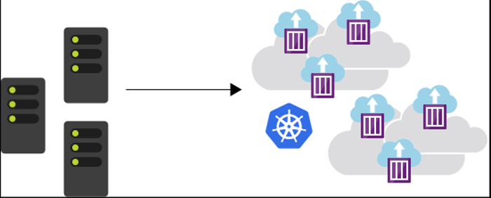

# Introduction into Kubernetes

**Kubernetes** is a portable, extensible open-source platform for managing and orchestrating containerized workloads. Kubernetes abstracts away complex container management tasks.  
It provides declarative configuration to orchestrate containers in different computing environments.  This orchestration platform gives you the same ease of use and flexibility you may already know from PaaS or IaaS offerings.

