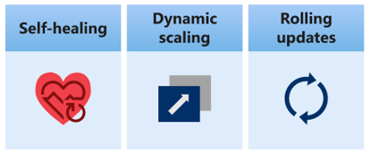
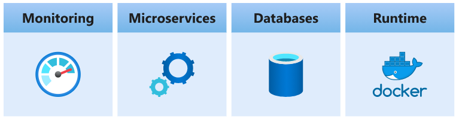
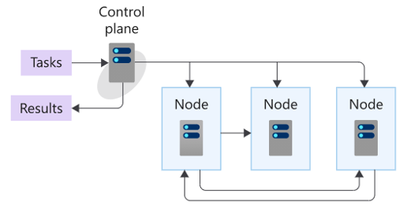
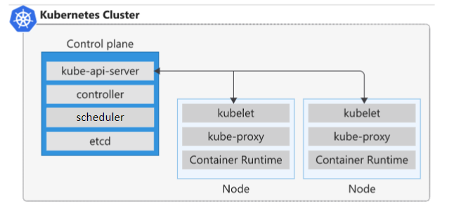

# Introduction into Kubernetes

**Kubernetes** is a portable, extensible open-source platform for managing and orchestrating containerized workloads, it abstracts away complex container management tasks.  
It provides declarative configuration to orchestrate containers in different computing environments.  This orchestration platform gives you the same ease of use and flexibility you may already know from PaaS or IaaS offerings.

# Benifits of Kubernetes

- Self-healing of containers - An example would be restarting containers that fail or replacing containers.
- Scaling deployed containers up or down dynamically, based on demand.
- Automating rolling updates and rollbacks of containers.
- Managing storage.
- Managing network traffic.
- Storing and managing sensitive information, such as usernames and passwords.

# Kubernetes considerations
- With Kubernetes, you can view your datacenter as one large compute resource. You don't worry about how and where you deploy your containers, only about deploying and scaling your apps, as needed

It's important to understand that Kubernetes isn't a single installed app that comes with all possible components needed to manage and orchestrate a containerized solution:

- Aspects such as deployment, scaling, load balancing, logging and monitoring are all optional. You're responsible for finding the best solution that fits your needs.

- Kubernetes doesn't limit the types of apps that can run on the platform. If your app can run in a container, it can run on Kubernetes. To make optimal use of containerized solutions, your developers need to understand concepts, such as microservices.

- Kubernetes doesn't provide middleware, data-processing frameworks, databases, caches, or cluster storage systems. All these items are run as containers, or as part of another service offering.

- For Kubernetes to run containers, it needs a container runtime, like Docker. The container runtime is the object that's responsible for managing containers. For example, the container runtime starts, stops, and reports on the container's status.

- You're responsible for maintaining your Kubernetes environment. For example, you need to manage OS upgrades and the Kubernetes installation and upgrades. You also manage the hardware configuration of the host machines, such as networking, memory, and storage.

- Cloud services, such Azure Kubernetes Service (AKS), reduce these challenges by providing a hosted Kubernetes environment. These services also simplify the deployment and management of containerized apps in Azure. With AKS, you get the benefits of open-source Kubernetes without the complexity or operational overhead of running your own custom Kubernetes cluster.

# How Kubernetes works
- A successfully configured Kubernetes installation depends on a solid understanding of the Kubernetes system architecture. 

**What is a computer cluster?**

- A cluster is a set of computers that you configure to work together and view as a single system. The computers configured in the cluster will typically do the same kinds of tasks, such as; host websites, APIs, or run compute-intensive work.

- A cluster uses centralized software that's responsible for scheduling and controlling these tasks. The computers in a cluster that run the tasks are called nodes, and the computers that run the scheduling software are called control planes.

# Kubernetes architecture

- An orchestrator is a system that deploys and manages apps and a cluster is a set of computers that work together and are viewed as a single system. 

- You use Kubernetes as the orchestration and cluster software to deploy your apps and respond to changes in compute resource needs.

