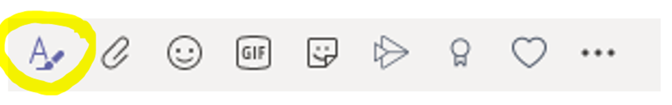
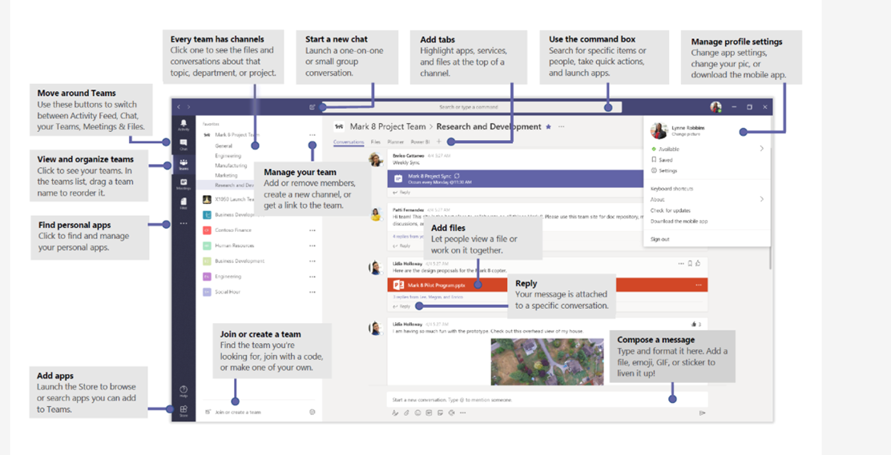
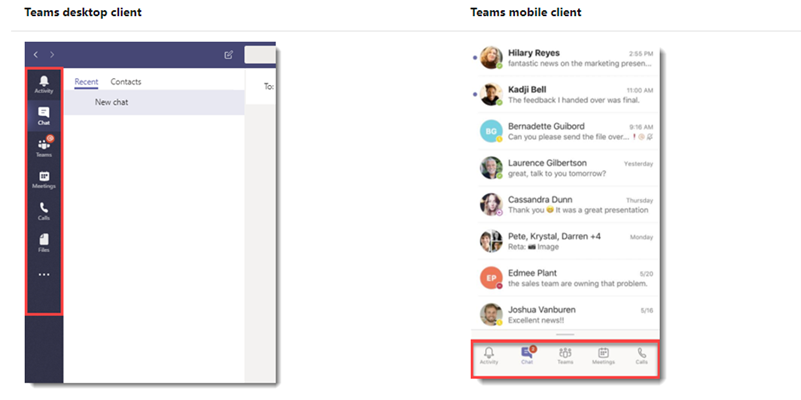

# Microsoft Teams: glossary of Teams terms
A team is a collection of people working towards a shared goal or employed to deliver a function.

**Teams** are built on **Microsoft 365 Groups** – the foundational membership service that drives all teamwork across Office 365.

A team includes the content and tools to enable the goal or function and is typically either:
-	Project-based, e.g. launching a product
-	Department or location-based – e.g. your customer service team or Belgian office

Two types of Microsoft Teams.

## Public Team:
One that is open to anyone in your organisation – up to 10,000 people – to join. They don’t need someone’s approval to join it.

**Note:** You can easily change a public team to private, and vice-versa.

## Private Team:

Invited members only – the team’s owner adds and removes them. Currently (August 2020), a private team is not visible to everyone in your organization, but in future, there will be the option to make private teams discoverable – Manage discovery of private teams in Microsoft Teams.
 
## Microsoft Teams Channels

A team comprises of **channels**; they are where the work gets done. When you create a team, you get a channel called ‘General’ by default. And it’s always first; you can’t delete it or change its name.
As the name suggests, you can use the General channel to discuss routine and ad hoc matters concerning the team.
To give order and structure to your team’s activities, you can add other channels, for example, by topic, department or project.

Channels allow you to:

**1, Collaborate with team members via:**
   - Online conversations – known as persistent chat
   - Audio and video calls
   -	Scheduled meetings
   -	Impromptu meetings, with Meet now
   -	Announcements – which stand out from the conversation (more later)
   -	Share external emails – forward emails to your channel. Get the channel email address by selecting the ellipsis (row of three dots) beside it.
  	 
**2,	Manage Files** – access, share and edit. Files uploaded to a channel are stored in SharePoint. File size limits are 100 GB, and there’s a maximum of three folder levels deep. Files can be synced for offline access. Click the ellipsis beside your file name to reveal a drop-down menu of options, which include download, copy link (ideal for sharing with team members), and open in SharePoint. 

**3, Make Announcements** – make your conversation stand out. There’s a main heading field together with a sub-heading, and you can apply a background colour or image. When starting a new conversation, click on the symbol circled below.

Then click on ‘New conversation’ and select Announcement from the drop-down. 

**4, Add Apps** – display them as tabs inside your channel or you can set them to push information into channel conversations. 

**5, Build a Wiki** – a way of structuring information using a digital notebook. The channel’s Wiki could contain evergreen advice for your team or be about the team. If you want, you can rename or remove Wiki. 

**6, Use Bots** – choose from the Teams App Store or create your own. More on bots later. 

## Standard Channels
Most channels are **standard**, meaning they’re available to every team member. By default, all members can create standard channels. 

## Private Channels
**Private channels** are not open to all team members – they enable some of the team’s existing members to collaborate on confidential or sensitive matters. Any member of the team can create a private channel and choose which of their team members to add.

There a few nuances with private channels to be aware of, notably:
-	File storage for a private channel is held separately in SharePoint
-	A private channel supports tabs and connectors
-	A private channel does not support bots or apps (e.g. Planner)
-	Nor does it support scheduled channel meetings
-	You can invite guests (people from outside your organisation), but they must be a member of the parent team. 

## Tabs
If you think of your Teams channel as your virtual office or department, then tabs are the digital drawers of its filing cabinet. By default, each channel comes with three tabs:

-	Posts – your team’s conversations
-	Files
-	Wiki

You can add new tabs to your channel, such as your favourite apps or even websites you frequently visit. 

If you’re in a one-to-one in chat with someone outside a channel, you’ll see a different set of tabs:

-	Chat
-	Files
-	Organisation – if it’s been set up, you’ll see your organisation’s structure chart and where that person sits.
-	Activity – a record of that person’s activity in Teams.

And again, you have the option of adding other tabs, which could be useful if you work with that person a lot but don’t have a formal channel. 

## Chat
Using @mention (e.g. @general or @name), Team’s versatile online chat functionality enables you to:

- Chat with a group of people in your organisation
-	Chat inside channels – with one or more team members or guest members (people outside your organisation).
-	Chat during meetings

And Teams enables you to access and search chat history. 

## Private chat

Private chats happen outside public channels. You can have them one-one, or with a group of people in your organisation. If you have these chats with the same person or group frequently, it might be worth creating a private channel instead. 

## Tags

A tag is a way of adding an identifier to selected members of a team, enabling you to reach all of them at once.

Let’s say you have a 20-strong team of marketing people, which includes four graphic designers. Create a tag for your designers and add them to it. When you want to start a chat with them,  @mention your tag in a channel or type the tag name in a new chat.
 
## Channel Meetings

You can schedule a meeting or choose ‘Meet now’ to hold a meeting with Team members. Channel meetings are open, meaning:

-	A channel meeting is open to every team member to join
-	The history of the meeting – the conversation, is visible to all team members afterwards

And you can choose to record the meeting; when it’s over the recording is automatically stored in Stream. You can publish the recording in the channel, get a link to email it, drop it into Yammer or embed it in a website. 

## Live Events

Live events are an extension of Teams meetings. They enable you to broadcast your video and meeting content to a large online audience. Live Events are intended for one-to-many communications.

The event host leads the interactions; audience participation is primarily to view the content the host shares. As with Teams meetings, you can record the event and share it afterwards. 

## Teams Voice

Teams Voice is a cloud-based telephony solution in Microsoft Teams. As a complete replacement for your enterprise telephone system, it equips your business with a fully unified communications environment that travels with your users.

For a deeper dive, check out Microsoft Teams Voice FAQs. 

## Teams Apps
Many of the tools your organisation relies on can be added to Teams. You can add an app as a tab in a channel, and some apps let you push content directly into Teams conversations. Explore your options by clicking the Apps icon.

You can use three types of apps in Microsoft Teams:

-	Microsoft created apps; e.g. SharePoint, Forms, Power BI.
-	Third-party apps; e.g. Trello, ServiceNow
-	Custom apps; e.g. self-built, or line of business apps 

## Wiki

Teams Wiki is a digital notebook where you can organise information in a more structured way. A  noisy fast-flowing Teams channel is unlikely to be the best place to house, say, a product specification change or adjustments to a business plan.
For core, critical information your people need at their fingertips, or for getting new starters quickly up to speed, Wiki could be your logical hub.

## Teams Connectors

Connectors keep your team current by giving you the means to:

-	Push content from other places (services or URLs) into a channel and;
-	Configure notifications, e.g. the frequency of an update

Teams connectors are grouped into categories, including News & Social, Analytics, and Project Management. Here are just a few examples of what you can use Teams connectors for:

-	Updates from your Yammer network
-	Reports from your Google Analytics account
-	RSS feeds – receive blog posts from your favourite website
-	Be notified when someone completes a survey using Microsoft Forms 

## Microsoft Teams Bots

Microsoft Teams enables you to choose from a list of off-the-shelf bots; computer programmes for giving your members an interactive experience.

The list is almost endless – there are bots to aid productivity, provide information, run polls, crunch numbers and help meetings.

You can add a bot to a tab in a Teams channel, or your members can access it using the @ function in a chat.

And if you’re feeling adventurous, create your own bot. In this on-demand webinar by Content and Code (a Content+Cloud company), we show you how to create an FAQ bot for Microsoft Teams: How to Use Power Apps to Transform Your Microsoft Teams Meetings. 

## Adaptive Cards

An adaptive card is a way to share information in a Teams chat. As the name suggests, it’s highly customisable. An adaptive card can contain richly formatted text, images and graphs. And it can be interactive, e.g. with buttons and input fields.

One of the neat things about adaptive cards is that you can use them across other Microsoft 365 applications, such as Outlook and bots.

Check out this blog by one of our Microsoft MVPs (Most Valued Professionals), Steve Goodman: Creating Adaptive Cards in Microsoft 
Teams. 

# Teams User Interface

And here’s a quick tour of the Microsoft Teams user interface (UI), along with some standard UI terms. 

## Teams Navigation
 
 

## Microsoft Teams Keyboard Shortcuts

Check out these shortcuts for Windows and Mac users – [Keyboard shortcuts for Microsoft Teams](https://support.microsoft.com/en-us/office/keyboard-shortcuts-for-microsoft-teams-2e8e2a70-e8d8-4a19-949b-4c36dd5292d2)

## Left Rail

If you’re using Teams on a desktop, the ‘left rail’ is the term for the menu ribbon to the far left of your screen. On a mobile view (iOS or Android), the menu ribbon appears at the foot.
 
 
 
## App bar (desktop term)

The app bar is where your pre-installed apps are. If you’re using Teams on a desktop, click on the ellipsis in the left rail to view your app bar. 

## App tray (mobile term)

If you’re using Teams on a mobile (iOS and Android), the app tray is at the bottom of your screen. Swipe up to see your pre-installed apps. 

## Soar through your day with Microsoft Teams  

Hope this glossary cleared up any questions you might have had, but if not, to pick up Microsoft Teams best practice, hacks and insights, download a [free Microsoft Teams Guide](https://contentandcloud.com/revolutionise-your-workplace-with-microsoft-teams/) which also tackles a universal need – how to improve your meetings.  
