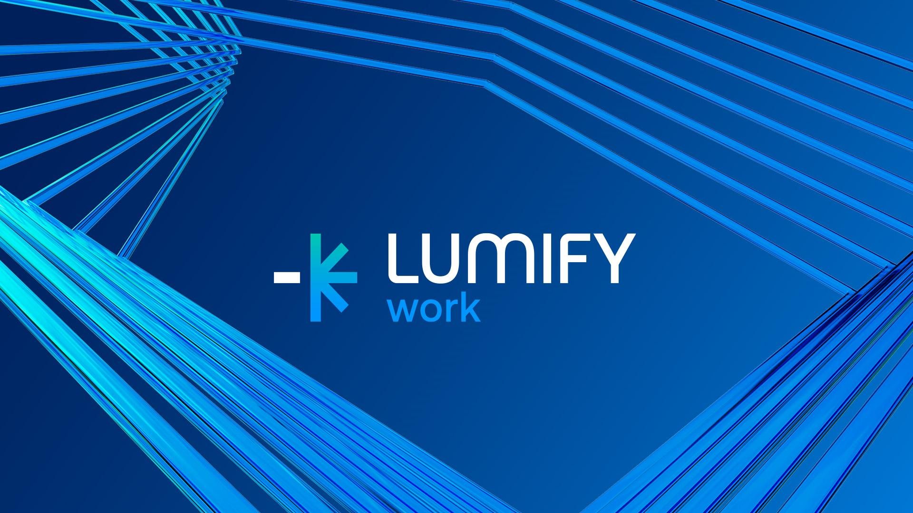

# DDLS Course Engagement

This repository holds notes and resources used for Lumify Work (formally DDLS) course delivery.
* [Website](https://www.lumifywork.com.au)

Please use it during your course and as a reference after completing the course.

## Contents

Use the directory list above to navigate the repositories content.

Alternatively, consider adding Octotree to your browser:

* [FireFox](https://addons.mozilla.org/en-US/firefox/addon/octotree/)
* [Chrome](https://chrome.google.com/webstore/detail/octotree/bkhaagjahfmjljalopjnoealnfndnagc)
* [Opera](https://addons.opera.com/en/extensions/details/octotree/)

_Note: You really should be using Firefox or another browser, not Chrome. [Here is why!](Internet/Firefox.md)._
